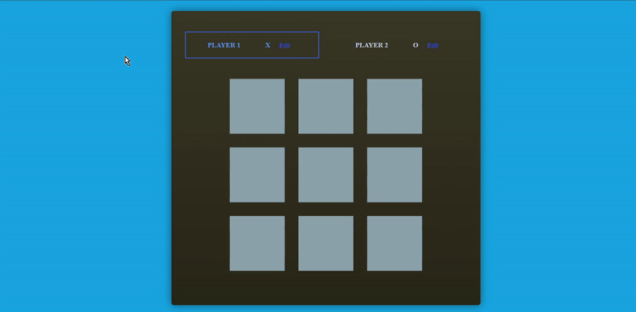

# Tic-Tac-Teo



A simple yet interactive Tic-Tac-Toe game built with **React**, **JavaScript**, **CSS**, and powered by **Vite**.

## 🎮 Features

- Two-player game
- Custom player name input
- Turn indicator showing whose move it is
- Real-time winner detection and winner display
- Clean and responsive UI styled with CSS

## 📦 Getting Started

### Clone the repo

```bash
git clone https://github.com/KamilDziuk/tic-tac-teo.git
cd tic-tac-teo
````

### Install dependencies

```bash
npm install
```

### Run the development server

```bash
npm run dev
```

### Build for production

```bash
npm run build
```

## 🧠 How It Works

* The game board is a 3x3 grid managed with React state.
* Each player takes turns marking a cell.
* The game checks for a win after every move.
* When a winner is detected (or a draw), a message is displayed.

## Play the Game
[Play Tic-Tac-Teo](https://tic-tac-teo-seven.vercel.app/)

Enjoy playing!